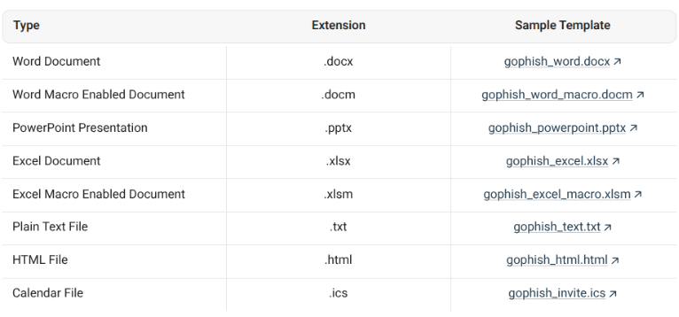
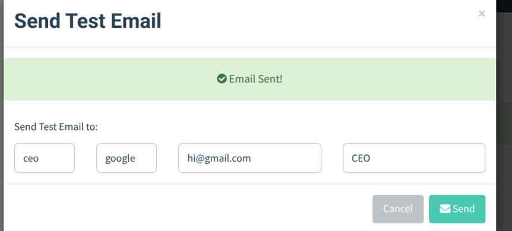
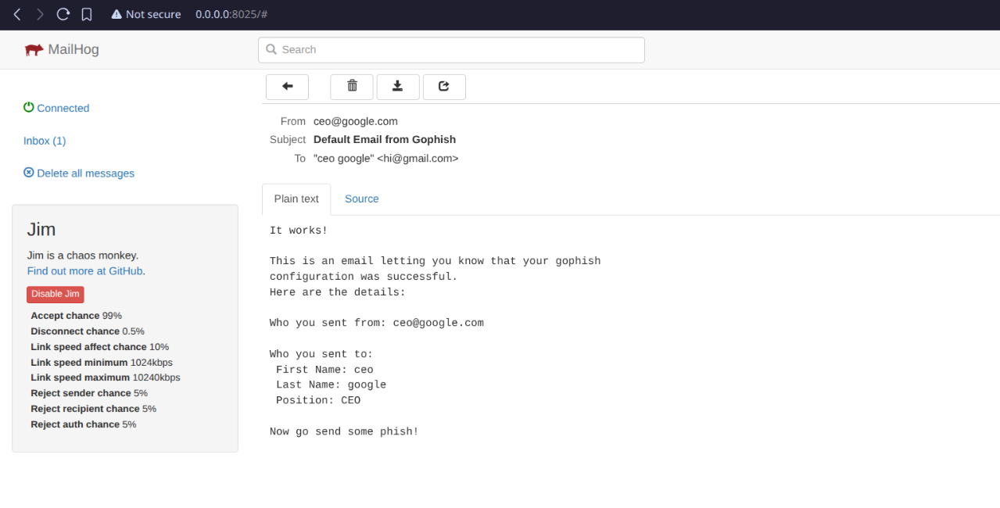

> all of this is deployed locally, at the moment.

# TO IMPLEMENT

- [ x ] understand gophish
- [ x ] make a trial campaign
- [ ] gophish deployment
- [ ] mailhog or equivalent SMTP server deployment

## Steps necessary to build a fishing service

### 1. Templates

- This section deals with the email templates, which is the main thing used for phishing.
- Essentially you can make your template here, complete with attachments, email body, sender address, and subject.

### 2. Attachment Tracking

- Now that I've attached a few files in the email, i can monitor whether the reciever has interacted with the file or not.
- There are a lot of ways to accomplish that, typically by emdedding info into the attachments or using macros, like in word docs.
- [Gophish](https://docs.getgophish.com/user-guide/documentation/attachments) has a complete list of template variables which can be used.
->


### 3. Landing Pages

- This is this core of majority of the phishing emails.
- These "fake" html landing pages are embedded in the email, and when the reciever clicks on it, we can capture credentials, track the user or keep popups.
- Technically this all depends on how elaborate the scam is, the landing page can be as dangerous.

### 4. Sending profile

- This is the final part of a phishing campaign
- This is the config for the SMTP relay.
- To actually send the email, you need to have a [server](https://github.com/mailhog/MailHog) configured.
- All the details, like 'From' Email address needs to be legit.

I'm using mailhog, and upon running `mailhog`, i get:

```
2025/07/01 16:21:18 Using in-memory storage
2025/07/01 16:21:18 [SMTP] Binding to address: 0.0.0.0:1025
[HTTP] Binding to address: 0.0.0.0:8025
2025/07/01 16:21:18 Serving under http://0.0.0.0:8025/
Creating API v1 with WebPath: 
Creating API v2 with WebPath:
```

- the SMTP address is `0.0.0.0:1025`

->



->



As of now, all of this is running locally, i'll need to host both services inorder for it to work.

Now that all of this is setup, i can go ahead and make a campaign.

-> Campaign Creation

[image](./assets/campaign_created.png)

-> Campaign Dashboard

[image](./assets/campaign_stats.png)

-> Mailhog Dashboard

[image](./assets/campaign_works.png)
